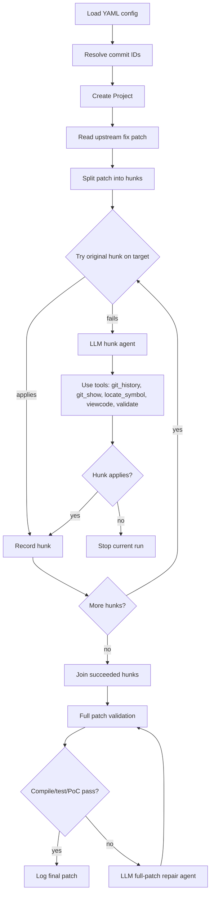
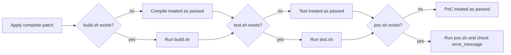
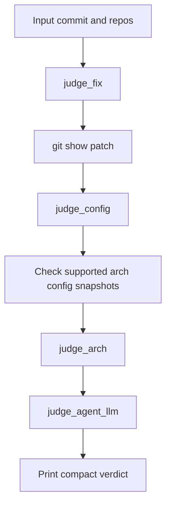

# Architecture

RetroPatch is organized around two related workflows:

- the main backporting workflow, which adapts a known upstream fix commit to an older target revision
- the prejudge workflow, which filters kernel commits before the heavier backporting workflow is attempted

The main workflow is the behavioral center of the repository. It combines Git operations, patch parsing, repository inspection tools, LLM-guided hunk rewriting, and validation hooks supplied by each case directory.

## Repository Components

```text
src/backporting.py        Main CLI, config loading, log setup, top-level orchestration
src/agent/                LLM construction, prompts, and backport loop
src/tools/project.py      Git checkout/apply/validate behavior and LangChain tool adapters
src/tools/utils.py        Patch splitting, fuzzy matching, and patch revision helpers
src/prejudge/             Kernel-oriented pre-backport judgment pipeline
src/check/usage.py        Optional OpenAI usage accounting helper
test/                     Manual helper scripts for hunk, patch, and prejudge workflows
skills/                   Local agent skill and repository-specific references
```

The `Project` class in `src/tools/project.py` owns most runtime state. It stores the target repository, resolved commits, hunk progress flags, generated patches, symbol maps, and validation status.

## Main Backporting Flow



The first phase treats each hunk independently. RetroPatch tries the original hunk first; only failing hunks are sent to the LLM agent. This keeps simple hunks cheap and gives the agent focused context when a conflict exists.

The second phase joins all accepted hunks into a complete patch and validates the full patch. If full validation exposes compile, testcase, or PoC problems, a separate repair prompt asks the agent to revise the complete patch.

## Hunk Adaptation Loop

Each failed hunk is handled as a localization and transformation problem:

1. Identify whether the hunk is relevant to the target revision.
2. Locate the corresponding code in the target revision.
3. Understand symbol renames, file moves, missing code, and context drift.
4. Generate a target-version hunk with context copied from target source code.
5. Validate the hunk with `git apply`.
6. Repeat with tool feedback until the hunk applies or the agent reaches its iteration limit.

The loop is deliberately tool-driven. The model is not expected to know the repository from memory; it should inspect the target tree through the tools and use validation feedback as the source of truth.

## Information Retrieval Tools

The main agent has five tools:

- `viewcode`: reads a line range from a file at a Git ref
- `locate_symbol`: locates symbols through a ctags-generated index
- `git_history`: summarizes line history for the current hunk from the merge base to the newer vulnerable revision
- `git_show`: inspects the last commit surfaced by `git_history` and highlights likely moved or newly introduced code
- `validate`: applies a hunk, marks a hunk as not needed, or validates the complete patch depending on workflow state

Together, these tools approximate the manual activities needed for conflict resolution: inspect code, locate symbols, trace provenance, apply a candidate patch, and refine based on concrete failures.

## Validation Flow

Full patch validation is implemented in `Project._validate()` and follows this ladder:



If a hook is missing, the corresponding stage is treated as passed. This makes small cases easy to run, but it also means case authors must provide hooks when they need stronger assurance.

## Prejudge Flow

The prejudge workflow lives under `src/prejudge/` and is separate from the main YAML-driven backporting flow.



Its current output contract is intentionally terse:

- `true`
- `false, fix commits missing`
- `false, arch not supported`
- `false, vulnerable code not found`

Downstream scripts may parse these strings, so changes to verdict text should be treated as interface changes.

## Runtime State Boundaries

The main workflow mutates the configured `project_dir` heavily. `Project._checkout()` resets and checks out revisions, hunk validation repeatedly applies and resets patches, and full validation copies scripts from `patch_dataset_dir` into `project_dir`.

For architectural changes, keep these boundaries in mind:

- `src/backporting.py` should remain responsible for CLI/config/log setup.
- `src/agent/` should remain responsible for prompts and agent orchestration.
- `src/tools/project.py` should remain responsible for concrete repository operations and tool behavior.
- `src/tools/utils.py` should remain responsible for patch text utilities.
- `src/prejudge/` should remain independent of main backporting YAML unless configuration unification is an explicit goal.

