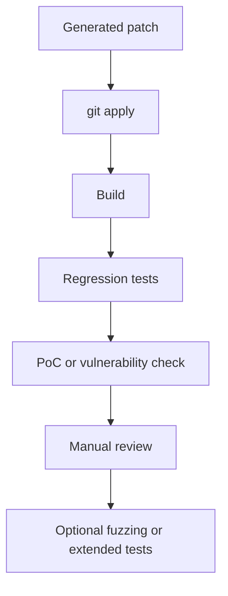

# Evaluation

RetroPatch can be evaluated at several levels. A useful evaluation separates mechanical patch application from build correctness, vulnerability effectiveness, regression safety, and human review.

## Success Criteria

A backport should be considered successful only when the evidence matches the goal of the case.

Minimum criteria:

1. The generated patch applies to `target_release`.
2. The patched project builds, or the case explicitly does not require a build.
3. Existing regression tests pass, or no testcase is available.
4. The PoC no longer triggers the expected `error_message`, or no PoC is available.
5. A reviewer confirms the patch fixes the intended root cause without introducing an obvious regression.

The first criterion is mechanical. The remaining criteria determine whether the patch is useful.

## Patch Categories

When reporting results, classify cases by how much adaptation was needed:

- `Type-I`: The original patch applies without change.
- `Type-II`: The patch logic is unchanged, but location changes are needed, such as line or file movement.
- `Type-III`: Syntactic adaptation is needed, such as renamed functions, variables, struct fields, or helper APIs.
- `Type-IV`: Logical or structural adaptation is needed, such as adding/removing lines, changing control flow, handling target-only code shape, or resolving dependencies between hunks.

This classification helps explain why a case succeeded or failed. Type-IV cases are usually the most informative for assessing the LLM-tool loop.

## Per-Case Metrics

Record these fields for every case:

- project name
- language
- `new_patch`
- `new_patch_parent`
- `target_release`
- patch category
- number of files changed
- number of hunks
- modified lines
- whether each hunk applied directly
- whether LLM adaptation was needed
- final apply result
- build result
- testcase result
- PoC result
- manual review result
- runtime
- token usage and estimated cost when available
- failure reason if unsuccessful

For batch runs, write these fields to a CSV or JSONL file rather than relying only on logs.

## Validation Ladder

Use a staged validation ladder:



A failure at any stage should preserve enough diagnostic output for analysis:

- `git apply` stderr or context mismatch feedback
- compiler error lines
- testcase output
- PoC output
- reviewer notes

## Ground Truth Comparison

When a known target-version fix exists, compare RetroPatch output with the known patch.

Useful comparison levels:

- exact textual match
- same files and same functions
- same security condition or root-cause fix
- equivalent behavior with different implementation
- incomplete or overbroad fix

Exact textual equality is useful but too strict for backporting. A correct target patch may differ from the known patch while preserving the same fix.

## Manual Review Checklist

Reviewers should check:

- The patch targets the vulnerable code in the target version.
- Context lines are copied from target source, not blindly from the newer patch.
- Renamed symbols and changed data structures are mapped correctly.
- Error paths, locks, reference counts, and cleanup labels remain consistent.
- The patch does not rely on helper functions or macros absent from the target version.
- All hunks needed for the root cause are present.
- No unrelated formatting or behavior changes are introduced.
- Validation hooks exercise the relevant code path where possible.

For security cases, at least one reviewer should reason about root cause, not only syntax.

## Failure Taxonomy

Use consistent failure labels:

- `apply_failed`: The generated hunk or complete patch does not apply.
- `wrong_location`: The patch applies, but to the wrong code location.
- `missing_dependency`: The target version lacks a prerequisite helper, struct field, macro, or prior commit.
- `hunk_dependency_missed`: Per-hunk adaptation missed a dependency between hunks.
- `incomplete_fix`: The patch fixes only part of the vulnerable behavior.
- `compile_failed`: The patch applies but does not build.
- `test_failed`: Regression or functionality tests fail.
- `poc_failed`: The PoC still triggers the expected error.
- `manual_reject`: A reviewer identifies a correctness or safety problem not caught by automation.

## Prejudge Evaluation

For prejudge, evaluate it as a filtering system:

- true positive: commit needs backporting and prejudge returns `true`
- true negative: commit does not need backporting and prejudge returns a `false, ...` verdict
- false positive: prejudge returns `true` but backporting is unnecessary
- false negative: prejudge returns `false, ...` but the target actually needs the fix

False negatives are more severe for security maintenance. Keep the current conservative default in mind when interpreting results: some failures intentionally become `true` to avoid missing a needed fix.

## Efficiency Metrics

Track:

- total wall-clock time
- number of LLM calls
- number of tool calls
- input tokens
- output tokens
- estimated cost
- maximum agent iterations reached
- number of validation attempts

Break these down by patch category. Larger and more structural patches naturally require more tool calls and validation cycles.

## Reporting Template

For a case study, use this format:

```text
Case:
Target:
Patch category:
Why direct apply failed:
Localization path:
Transformation needed:
Validation evidence:
Manual review notes:
Final result:
Failure reason, if any:
```

This keeps results comparable across projects without requiring every case to expose private logs.
